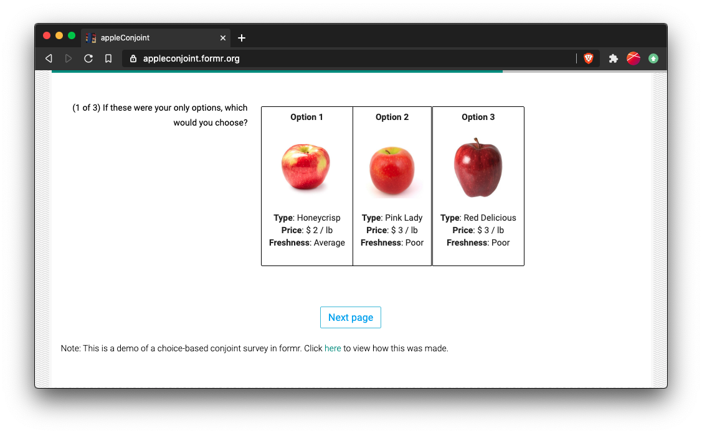
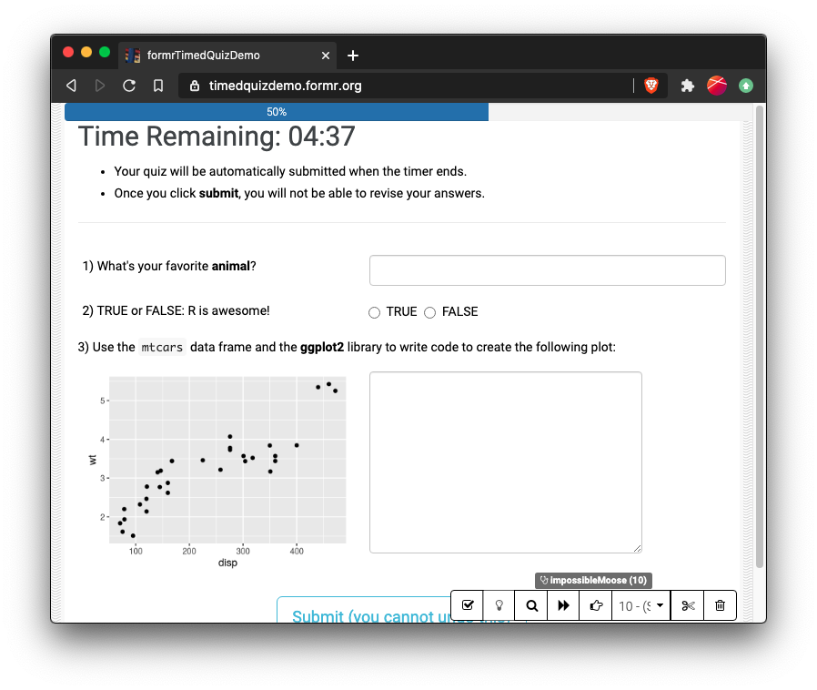
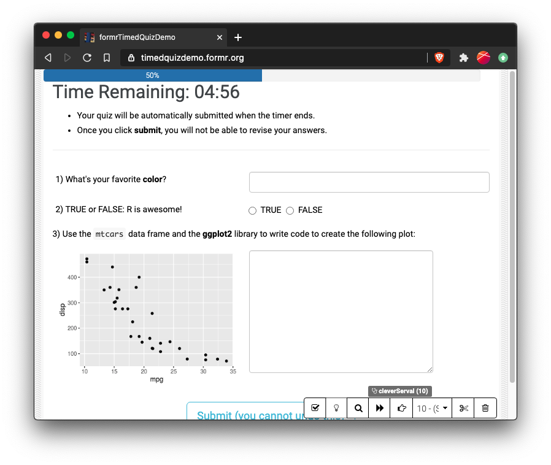
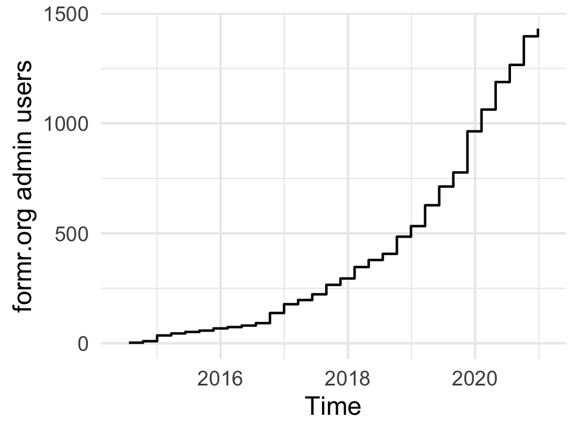
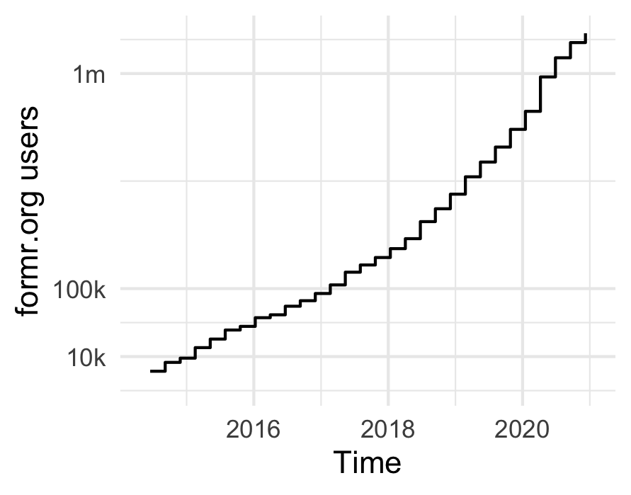

```{r setup, include=FALSE}
knitr::opts_chunk$set(
    warning = FALSE,
    message = FALSE,
    comment = "#>",
    fig.path = "figs/",
    fig.retina = 3 # Better figure resolution
)
library(knitr)
library(fontawesome)
today <- format(Sys.Date(), format="%B %d %Y")
```

```{r xaringan-tile-view, echo=FALSE}
# Enables the ability to show all slides in a tile overview by pressing "o"
# devtools::install_github("gadenbuie/xaringanExtra")
xaringanExtra::use_tile_view()
```

layout: true

<!-- this adds the link footer to all slides, depends on my-footer class in css-->

<div class="footer-small">
<span>
https://github.com/jhelvy/surveys-with-formr
</span>
</div>

---
name: title-slide
class: inverse, center, middle
background-image: url(images/blackboard.jpg)

# Using {formr} to create `r fa("r-project", fill = "white")` powered surveys<br>with individualized feedback

```{r child="faces.Rmd"}
```

.large[by John Paul Helveston]

`r today`

???

Hi I'm John Helveston, and thanks for tuning in to my lightning talk on how to make R-powered surveys with {formr}

---
class: center, middle

.leftcol[.noborder[
<br><br><br>
<center>

</center>
]]
.rightcol[.noborder[
<center>

</center>
]]

???

If you're someone who has ever had to make a survey, chances are you've probably used something like Survey Monkey or Google Forms.

And these platforms work great for simple surveys.

---
class: center, middle

.noborder[
<center>

</center>
]

???

But what if you needed your survey to be a little more complex than what these platforms offer?

---
class: center, middle, inverse

```{r child="formr-logo.Rmd"}
```

???

Well, thankfully some really clever people made formr, which uses R and RMarkdown code to create rich, complex surveys.

---
class: center, middle

.leftcol[.circle[
<center>

</center>
]
### Ruben C. Arslan
# [`r fa("github")`](https://github.com/rubenarslan) [`r fa("twitter")`](https://twitter.com/rubenarslan)
]
.rightcol[.circle[
<center>

</center>
]
### Cyril S. Tata
# [`r fa("github")`](https://github.com/cyriltata) [`r fa("twitter")`](https://twitter.com/cyriltata)
]

???

And just to be clear, I'm not one of those clever people. 

Formr was developed by Ruben Arslan and Cyril Tata.

---
class: center, middle, inverse

.leftcol[
# .font200[I `r fa("heart", fill = "red")`]

```{r child="formr-logo.Rmd"}
```
]
.rightcol[.circle[
<center>

</center>
# [`r fa("github", fill = "white")`](https://github.com/jhelvy) [`r fa("twitter", fill = "white")`](https://twitter.com/JohnHelveston)
]]

???

I'm just a formr super fan, and I made this talk to share it with the rest of the R community and to demonstrate some of the cool things you can do with it.

---
class: center, middle, inverse

```{r child="formr-logo.Rmd"}
```

# .font200[`r fa("question", fill = "white")`]

???

So what can formr do?

---
class: middle, center, inverse

<style>
.columnnarrow {
  float: left;
  width: 20%;
  padding: 5px;
}
</style>

.leftcol[.noborder[
<br><br><br><br>
]]
.columnnarrow[<br><br>
# .font200[`r fa("plus", fill = "white")`]
]
.rightcol30[
<center>

</center>
]

???

Well, I kind of think it like Survey Monkey plus RMarkdown.

You can use it create simple surveys, but you can also use R code to generate a much richer set of features.

---
class: middle, center

<center>

</center>

https://formr.org/interactive_charts

???

For example, you could create interactive charts that survey respondents could experience while taking the survey.

---
class: middle, center

.noborder[
<center>

</center>
]

.left[.font70[Fig. 3 from Arslan, R.C., Walther, M.P. & Tata, C.S. [formr: A study framework allowing for automated feedback generation and complex longitudinal experience-sampling studies using R](https://link.springer.com/article/10.3758/s13428-019-01236-y). Behav Res 52, 376–387 (2020).]]

???

Or you could use R code to generate dynamic feedback.

For example, images like this were generated with ggplot code for each respondent in a longitudinal study, showing them their risk preferences for different activities based on their answers to previous questions.

---
class: middle, center, inverse

# .font200[how]

```{r child="formr-logo.Rmd"}
```

# .font200[works]

???

At this point you may be wondering how this all works. 

So let's dig into some of the details.

---
class: center, middle
background-color: #FFFFFF

# Open source components

.leftcol40[.noborder[
<center>

</center>
]]
.columnnarrow[<br><br>
# .font200[`r fa("plus", fill = "black")`]
]
.rightcol40[.noborder[
<center>

</center>
# .font150[OpenCPU]

(Thanks to Jeroen Ooms! [`r fa("twitter", fill = "blue")`](https://twitter.com/opencpu))
]]

???

Surveys in formr are built using open source components

The text and code for each survey are input using Google sheets, 

and once the survey is live, R code is computed using Open CPU. 

This makes it really easy to make your work as transparent as you'd like.

---
class: center, middle
background-image: url(images/googlesheet0.png)
background-size: contain

???

Here is an example Googlesheet.

Each row is an item that will be displayed on the survey.

Each column controls what will be shown.

---
class: center, middle
background-image: url(images/googlesheet1.png)
background-size: contain

???

The "label" column is where you insert markdown or code chunks that you want to display in the survey. 

---
class: center, middle
background-image: url(images/googlesheet2.png)
background-size: contain

???

The "type" column is where you set the type of each question to show.

You can choose from a long list of options, like multiple choice, text entry, or simply just display text or images.

---
class: center, middle
background-image: url(images/googlesheet3.png)
background-size: contain

???

Depending on the type of question, you may also have some options for respondents to choose from, like in a multiple choice question.

---
class: center, middle
background-image: url(images/googlesheet4.png)
background-size: contain

???

And you can also customize the look and feel with some styling options

It's analygous to a R Markdown document, where the style and question type columns are sort of like the YAML

And the label and choice columns contain the content you want to display.

---
class: middle

<center>

</center>

???

Once you've got your spreadsheet ready, you can login to formr.org, input the link to your Googlesheet, and formr will convert it into a survey.

---
class: center, middle
background-image: url(images/screenshot-apple.png)
background-size: contain

???

The example I just showed generates a survey with multiple choice questions about apples that look like this in a web browser.

---

# .center[Use the {formr} package to get data]

.leftcol20[&zwj;]
.leftcol60[
```{r, eval=FALSE}
library(formr) #<<

# Connect to formr
formr_connect( #<<
  email    = 'youremail@gmail.com', #<<
  password = '*****') #<<

# Import raw data
raw <- formr_raw_results(survey_name = 'apples') #<<

# Save raw data
write_csv(raw, here::here('raw_data.csv'))
```
]

???

Once your survey is live, you can use the associated formr R package to import results as a nicely formatted data frame.

---
class: middle, center, inverse

# .font140[Showing randomized images]
<br>
# .font140[Timed, randomized quizzes]

???

Now that we know a little bit about how formr works, I'd like to show a couple examples of how I've used formr in my own work.

---
class: middle, center, inverse

# .orange[.font140[Showing randomized images]]
<br>
# .font140[Timed, randomized quizzes]

???

I'll start with an example showing people randomized images in a research method known as conjoint analysis.

---
class: center, middle
background-image: url(images/screenshot-conjoint.png)
background-size: contain

???

In conjoint surveys, you ask people to choose from randomized profiles of different products. You can then use that data to estimate their preferences for attributes of those products. 

So, for example, if I wanted to know how people felt about the price or freshness of different apples, I could ask them to choose from profiles like this.

In each question, I'll randomly change the values in the profiles.

---
class: middle

.code80[
```{r, echo=FALSE, eval=FALSE}
design <- read.csv("https://raw.githubusercontent.com/jhelvy/formr4conjoint/master/survey/doe.csv")
head(design)
```
```{r, eval=FALSE}
#>            type price freshness            image respID qID altID obsID
#> 1          Gala   1.0 Excellent         gala.jpg      1   1     1     1 #<<
#> 2          Gala   4.0      Poor         gala.jpg      1   1     2     1 #<<
#> 3     Pink Lady   1.0 Excellent     pinkLady.jpg      1   1     3     1 #<<
#> 4    Honeycrisp   2.5      Poor   honeycrisp.jpg      1   2     1     2
#> 5 Red Delicious   2.5      Poor redDelicious.jpg      1   2     2     2
#> 6 Red Delicious   1.0 Excellent redDelicious.jpg      1   2     3     2
```
]
.noborder[
<center>

</center>
]

???

And because I'm working in R, I can pre-define the profiles in a data frame.

So in this example, the three profiles shown are generated from the first three rows in this data frame.

---
class: middle, center, inverse

# .font140[Showing randomized images]
<br>
# .orange[.font140[Timed, randomized quizzes]]

???

I've also used formr to create timed, randomized quizzes for my classes.

---
class: middle

```{r}
q1a <- "What's your favoriate **animal**?"
q1b <- "What's your favoriate **color**?"
```

.leftcol[

### .center[Version A]

```{r, eval=FALSE}
q1_text <- sample(c(q1a, q1b), size = 1)
q1_text
```
```{r, echo=FALSE}
q1a
```
Display text:
```{r, eval=FALSE}
`r q1_text`
```
`r q1a`
]
.rightcol[

### .center[Version B]

```{r, eval=FALSE}
q1_text <- sample(c(q1a, q1b), size = 1)
q1_text
```
```{r, echo=FALSE}
q1b
```
Display text:
```{r, eval=FALSE}
`r q1_text`
```
`r q1b`
]

???

I do this by creating an "A" and "B" version of every question on a quiz. 

Then I use the sample function to randomly select a version for each question. 

In this example, you might be asked what's your favorite animal or what's your favorite color depending on which question is selected.

---
class: center, middle

.leftcol[.noborder[
<center>

</center>
]]
.rightcol[.noborder[
<center>

</center>
]]

???

With just a 5 question quiz, I can create 32 unique quizzes.

In this example, I've also added a timer so that the quiz will automatically submit when the time is up.

---
class: center, middle
background-image: url(images/screenshot-options.png)
background-size: contain

???

That's just a few examples of how I've used formr, but I encourage you to check out formr.org to see some of the other complex designs you can make, like longitudinal or diary studies with automated email and text message reminders.

---
class: center

.leftcol[
## Number of admin accounts
<center>

</center>
]
.rightcol[
## Number of surveys taken
<center>

</center>
]

???

Today, over a million people have filled out a survey on formr. 

And there's a growing user base with a very active support group, so you'll have the help you need to build whatever survey you want.

---
class: inverse, center, middle
background-image: url(images/blackboard.jpg)

# .font150[Thanks!]

```{r child="faces.Rmd"}
```

## https://formr.org/

.footer-large[
.right[
[@johnhelveston `r fa(name = "twitter", fill = "white")`](http://twitter.com/johnhelveston)<br>
[@jhelvy `r fa(name = "github", fill = "white")`](http://github.com/jhelvy)<br>
[@jhelvy `r fa(name = "weixin", fill = "white")`](http://www.box.jhelvy.com/docs/jhelvy.png)<br>
[jhelvy.com `r fa(name = "link", fill = "white")`](https://www.jhelvy.com)<br>
[jph@gwu.edu `r fa(name = "paper-plane", fill = "white")`](mailto:jph@gwu.edu)
]]

???

So head on over to formr.org, and start making some R-powered surveys!
