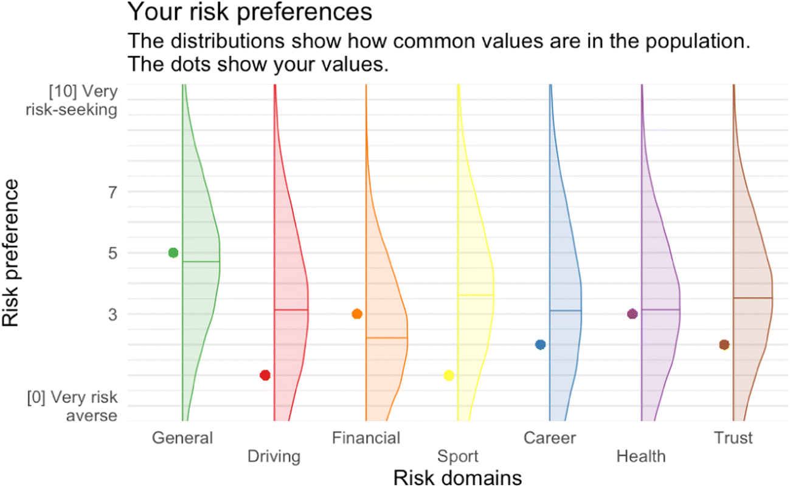

```{r setup, include=FALSE}
knitr::opts_chunk$set(
    warning = FALSE,
    message = FALSE,
    comment = "#>",
    fig.path = "figs/",
    fig.retina = 3 # Better figure resolution
)
library(knitr)
library(fontawesome)
today <- format(Sys.Date(), format="%B %d %Y")
```

```{r xaringan-tile-view, echo=FALSE}
# Enables the ability to show all slides in a tile overview by pressing "o"
# devtools::install_github("gadenbuie/xaringanExtra")
xaringanExtra::use_tile_view()
```

layout: true

<!-- this adds the link footer to all slides, depends on my-footer class in css-->

<div class="footer-small">
<span>
https://github.com/jhelvy/surveys-with-formr
</span>
</div>

---
name: title-slide
class: inverse, center, middle
background-image: url(images/blackboard.jpg)

# Using {formr} to create `r fa("r-project", fill = "white")` powered surveys<br>with individualized feedback

# .font150[ `r fa("sad-tear", fill = "white")` `r fa("frown", fill = "white")` `r fa("meh", fill = "white")` `r fa("smile", fill = "white")` `r fa("grin-beam", fill = "deepskyblue")`<br>&emsp;&emsp;&emsp;&emsp;&nbsp;`r fa("hand-point-up", fill = "deepskyblue")`]

.large[by John Paul Helveston]

`r today`

???

Hi I'm John Helveston, and thanks for tuning in to my lightning talk on how to make R-powered surveys with {formr}

If you're a researcher or educator, at some point you may need to create survey.

---
class: center, middle

.leftcol[.noborder[
<br><br><br>
<center>

</center>
]]
.rightcol[.noborder[
<center>

</center>
]]

???

The first place you might turn to are some of the free platforms out there, like Survey Monkey or Google Forms.

These platforms work great for simple surveys - they're easy to use, relatively secure, and getting the data from them is pretty straightforward.

---
class: center, middle

.noborder[
<center>

</center>
]

???

But what if you wanted to make a more complex survey, like one where questions are randomized, or where respondents can be shown interactive feedback of how their responses compare to others?

---
class: center, middle, inverse 

```{r child="formr-logo.Rmd"}
```

???

Well, thankfully some really clever folks at the George Elias Muller Institute created formr, which uses R and RMarkdown to create interactive surveys.

---
class: center, middle 

.leftcol[.circle[
<center>

</center>
]
### Cyril S. Tata
]
.rightcol[.circle[
<center>

</center>
]
### Ruben C. Arslan
]

???

Just for full disclosure, I am not part of the developer team for formr. Formr was developed by Cyril Tata and Ruben Arslan. 

---
class: center, middle, inverse

.leftcol[
# .font200[I `r fa("heart", fill = "red")`]

```{r child="formr-logo.Rmd"}
```
]
.rightcol[.circle[
<center>

</center>
]]

???

I'm just a big fan of the platform and wanted to share it with the rest of the R universe.

---
class: center, middle, inverse 

```{r child="formr-logo.Rmd"}
```

# .font200[`r fa("question", fill = "white")`]

???

So what can formr do?

Well, just about anything you can do with R code.

---
class: middle, center

<center>

</center>

https://formr.org/interactive_charts

???

For example, you could use any of the common R packages to make interactive charts that the survey respondent can experience.

---
class: middle, center

<center>

</center>

???

You could also use ggplot to create plots of the survey respondent's answers, giving them feedback about their answers. In this example, I'm showing the respondent how their risk preferences compare to those of others based on their answers to previous questions.

---
class: middle, center, inverse

# .font200[how]

```{r child="formr-logo.Rmd"}
```

# .font200[works]

???

1 minute showing the basics of how it works (using a demo google sheet to make questions, then uploading it to formr).

---
class: middle, center, inverse

# .font140[Showing randomized images]
<br>
# .font140[Making randomized quizzes]

---
class: middle, center, inverse

# .orange[.font140[Showing randomized images]]
<br>
# .font140[Making randomized quizzes]

???

1 minute showing how I've used it to create conjoint surveys, which again display randomized questions to each respondent.

---
class: middle, center, inverse

# .font140[Showing randomized images]
<br>
# .orange[.font140[Making randomized quizzes]]

???

1 minute showing how I've used it to create quizzes in my class with randomized questions for each student.

---
class: middle, center, inverse

# .font140[The {formr} package]

???

1 minute showing how to get data from a survey with the {formr} package
