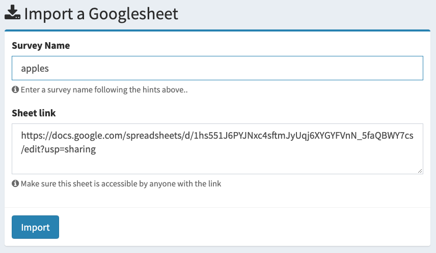

```{r setup, include=FALSE}
knitr::opts_chunk$set(
    warning = FALSE,
    message = FALSE,
    comment = "#>",
    fig.path = "figs/",
    fig.retina = 3 # Better figure resolution
)
library(knitr)
library(fontawesome)
today <- format(Sys.Date(), format="%B %d %Y")
```

```{r xaringan-tile-view, echo=FALSE}
# Enables the ability to show all slides in a tile overview by pressing "o"
# devtools::install_github("gadenbuie/xaringanExtra")
xaringanExtra::use_tile_view()
```

layout: true

<!-- this adds the link footer to all slides, depends on my-footer class in css-->

<div class="footer-small">
<span>
https://github.com/jhelvy/surveys-with-formr
</span>
</div>

---
name: title-slide
class: inverse, center, middle
background-image: url(images/blackboard.jpg)

# Using {formr} to create `r fa("r-project", fill = "white")` powered surveys<br>with individualized feedback

# .font150[ `r fa("sad-tear", fill = "white")` `r fa("frown", fill = "white")` `r fa("meh", fill = "white")` `r fa("smile", fill = "white")` `r fa("grin-beam", fill = "deepskyblue")`<br>&emsp;&emsp;&emsp;&emsp;&nbsp;`r fa("hand-point-up", fill = "deepskyblue")`]

.large[by John Paul Helveston]

`r today`

???

Hi I'm John Helveston, and thanks for tuning in to my lightning talk on how to make R-powered surveys with {formr}

If you're a researcher or educator, at some point you may need to create survey.

---
class: center, middle

.leftcol[.noborder[
<br><br><br>
<center>

</center>
]]
.rightcol[.noborder[
<center>

</center>
]]

???

The first place you might turn to are some of the free platforms out there, like Survey Monkey or Google Forms.

These platforms work great for simple surveys - they're easy to use, relatively secure, and getting the data from them is pretty straightforward.

---
class: center, middle

.noborder[
<center>

</center>
]

???

But what if you wanted to make a more complex survey, like one where questions are randomly displayed for each respondent, or where respondents can be shown interactive feedback about their responses?

---
class: center, middle, inverse

```{r child="formr-logo.Rmd"}
```

???

Well, thankfully some really clever folks at the George Elias Muller Institute created formr, which uses R and RMarkdown to create interactive surveys.

---
class: center, middle

.leftcol[.circle[
<center>

</center>
]
### Cyril S. Tata
]
.rightcol[.circle[
<center>

</center>
]
### Ruben C. Arslan
]

???

Just for full disclosure, I am not part of the developer team for formr.

Formr was developed by Cyril Tata and Ruben Arslan.

---
class: center, middle, inverse

.leftcol[
# .font200[I `r fa("heart", fill = "red")`]

```{r child="formr-logo.Rmd"}
```
]
.rightcol[.circle[
<center>

</center>
]]

???

I'm just a big fan of the platform, so I made this talk to share it with the rest of the R universe and demonstrate a few ways of how I've used it.

---
class: center, middle, inverse

```{r child="formr-logo.Rmd"}
```

# .font200[`r fa("question", fill = "white")`]

???

So what can formr do?

---
class: middle, center, inverse

<style>
.columnnarrow {
  float: left;
  width: 25%;
  padding: 5px;
}
</style>

.leftcol45[.noborder[
<br><br><br><br>
]]
.columnnarrow[<br><br>
# .font200[`r fa("plus", fill = "white")`]
]
.rightcol30[
<center>

</center>
]

???

Well, think of it like Survey Monkey plus RMarkdown.

You can use it field simple surveys, but you can also use R code to generate a much richer set of customized survey features.

---
class: middle, center

<center>

</center>

https://formr.org/interactive_charts

???

For example, you could insert code chunks to generate interactive charts that the survey respondent can experience.

---
class: middle, center

<center>

</center>

???

Or you could use R code to generate dynamic feedback about a respondent's answers. In this example, I'm showing the respondent how their risk preferences compare to those of others based on their answers to previous questions.

---
class: middle, center, inverse

# .font200[how]

```{r child="formr-logo.Rmd"}
```

# .font200[works]

???

So how does it work?

---
class: center, middle
background-image: url(images/googlesheet0.png)
background-size: contain

???

Formr relies on Googlesheets to input the main content for each survey.

Here's an example of a simple survey Googlesheet.

Each row is an item that will be displayed on the survey.

Each column controls what will be shown.

---
class: center, middle
background-image: url(images/googlesheet1.png)
background-size: contain

???

The "label" column is where you insert markdown or code chunks that you want to display in the survey.

---
class: center, middle
background-image: url(images/googlesheet2.png)
background-size: contain

???

The "type" column is where you set the type of each question to show. 

You can choose from a long list of options, like multiple choice, text entry, or simply just display text. 

---
class: center, middle
background-image: url(images/googlesheet3.png)
background-size: contain

???

Depending on the type of question, you may also have some options for respondents to choose from.

---
class: center, middle
background-image: url(images/googlesheet4.png)
background-size: contain

???

And you can also customize the look and feel with some styling options

---
class: middle

.noborder[
<center>

</center>
]

???

Once you've got your spreadsheet ready, you can go to formr.org, input the link to your Googlesheet, and your code will be compiled into a survey. 

---
class: center, middle
background-image: url(images/screenshot-apple.png)
background-size: contain

???

Here is one page from the example sheet I just showed you where I'm ask a multiple choice question.

---
class: middle, center, inverse

# .font140[Showing randomized images]
<br>
# .font140[Timed, randomized quizzes]

???

I'd like to spend the last couple minutes of this talk showing how I've used formr in my own work. 

Specifically, I've used formr to show people randomized images in a research method known as conjoint analysis, and I've also used it to create timed, randomized quizzes for my classes that I teach at George Washington University.

---
class: middle, center, inverse

# .orange[.font140[Showing randomized images]]
<br>
# .font140[Timed, randomized quizzes]

???

I'll start with a demo of how to display randomized images

---
class: middle, center, inverse

# .font140[Showing randomized images]
<br>
# .orange[.font140[Timed, randomized quizzes]]

???

I've used a similar approach to create timed, randomized quizzes for my classes. 

---
class: middle, center, inverse

# .font140[The {formr} package]

???

1 minute showing how to get data from a survey with the {formr} package
